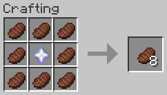

# Yummy Steak
A minecraft datapack: sprinkle steak with stardust for a filling meal.

## Content
- Craft _Filling Steak_ with 8 _Steak_ and 1 _Nether Star_ (center), which applies the saturation effect for an hour when eaten.  
  
- Adds level 30 enchantment _Yummy_ to never run out of steak (can only be applied on the _Filling Steak_).

## Technical Concept
Besides the gameplay functionality the goal was to provide these custom features without using the global tick function to check for changes in the player's inventory.

- saturation effect is applied via [`consumable` data component](https://minecraft.wiki/w/Data_component_format#consumable) (added in MC 1.21.2)
- not consuming the item is handled via the [`use_remainder` data component](https://minecraft.wiki/w/Data_component_format#use_remainder) (added in MC 1.21.2)
- as use_remainder would need a recursive definition to be infinitly reuseable, a dummy-item is used, which then is swapped out for the actual food item
- instead of constantly checking whether a dummy item exists and is in need of replacement, the [enchantment effect component `minecraft:tick`](https://minecraft.wiki/w/Enchantment_definition#Components_with_entity_effects) with the [entity effect `run_function`](https://minecraft.wiki/w/Enchantment_definition#run_function) (added in MC 1.21) is used to change the dummy item (only executed for one tick, when the item is first held, so more resource efficient).
